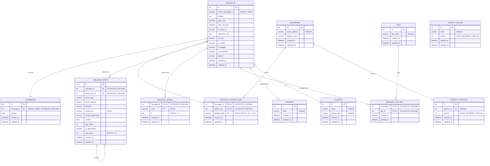

# テーブル定義

## er図

## 詳細

### 更新ポリシー

- 各テーブルの一覧に「更新可」列を追加し、○=更新可能 / ×=更新不可 を示す。
- 原則として作成後は不変（immutable）とし、更新は最小限。関係の変更は削除+挿入で扱う。
- created_at/updated_at はアプリで自動管理するため手動更新しない（= 更新可: ×）。
- PK/FK/一意識別子（例: id, rfc822_message_id, message_id 等）は更新不可。
- 基本的に更新可能なのは次のみ:
    - MESSAGES: is_read, is_replied, is_flagged, is_forwarded
    - SUMMARIES: content（要約の再生成/修正）
    - ADDRESSES: display_name（表示名の補正）
    - TAGS: tag_name（タグ名のリネーム）
    - PRIORITY_WORDS: priority（重みの調整）
    - PRIORITY_PERSONS: priority（重みの調整）

### MESSAGES（メール本体）

メールのメタデータ、状態、保管場所を管理する中核テーブル。RFC 822 の Message-ID で実体を一意に識別。

| フィールド | 型 | 制約 | 説明 | 更新可 |
|---|---|---|---|---|
| id | int | PK | 内部ID | × |
| rfc822_message_id | varchar | UNIQUE, INDEX | RFC 822 Message-ID ヘッダー値。メール実体の一意識別子 | × |
| subject | text |  | 件名 | × |
| date_sent | datetime |  | 送信日時（送信者側の送信時刻） | × |
| date_received | datetime | INDEX | 受信日時（サーバ到着/クライアント受信時刻） | × |
| in_reply_to | varchar |  | In-Reply-To ヘッダーの Message-ID | × |
| references_list | text |  | References ヘッダーの Message-ID 群（保存形式は実装依存） | × |
| is_read | boolean | INDEX | 既読フラグ | ○ |
| is_replied | boolean |  | 返信済みフラグ | ○ |
| is_flagged | boolean |  | フラグ付与フラグ | ○ |
| is_forwarded | boolean |  | 転送済みフラグ | ○ |
| vendor_id | int | FK → VENDORS.id | 取得元クライアントのID | × |
| folder_id | int | FK → FOLDERS.id | 所属フォルダのID | ○ |
| created_at | datetime |  | レコード作成日時 | × |
| updated_at | datetime |  | レコード更新日時（自動更新） | × |

備考: 複合インデックス (is_read, date_received DESC) を推奨。

---

### FOLDERS（フォルダ）

メールが所属するフォルダを管理するマスタテーブル。INBOX, Sent など。

| フィールド | 型 | 制約 | 説明 | 更新可 |
|---|---|---|---|---|
| id | int | PK | 内部ID | × |
| name | varchar | UNIQUE | フォルダ名（例: INBOX, Sent, Drafts） | ○ |
| system_type | varchar | UNIQUE | システム固定フォルダ種別（例: inbox, sent）。NULL許容 | × |
| created_at | datetime |  | レコード作成日時 | × |
| updated_at | datetime |  | レコード更新日時（自動更新） | × |

---

### VENDORS（取得元クライアント）

メールの取得元クライアント/サービスを管理するマスタテーブル。

| フィールド | 型 | 制約 | 説明 | 更新可 |
|---|---|---|---|---|
| id | int | PK | 内部ID | × |
| name | varchar | UNIQUE | クライアント/サービス名（例: thunderbird, gmail_import） | × |
| created_at | datetime |  | レコード作成日時 | × |
| updated_at | datetime |  | レコード更新日時（自動更新） | × |

---

### SUMMARIES（要約）

各メールの要約テキストを1件保持するテーブル。1:1 対応。

| フィールド | 型 | 制約 | 説明 | 更新可 |
|---|---|---|---|---|
| id | int | PK | 内部ID | × |
| message_id | int | FK → MESSAGES.id, UNIQUE, INDEX | 紐づくメールのID（メール1件につき要約は1件） | × |
| content | text |  | 要約本文 | ○ |
| created_at | datetime |  | レコード作成日時 | × |
| updated_at | datetime |  | レコード更新日時（自動更新） | × |

備考: FKは ON DELETE CASCADE。

---

### ADDRESSES（メールアドレス帳）

メールで登場するアドレスと表示名を正規化して保持。

| フィールド | 型 | 制約 | 説明 | 更新可 |
|---|---|---|---|---|
| id | int | PK | 内部ID | × |
| email_address | varchar | UNIQUE | メールアドレス（正規化保存） | × |
| display_name | varchar |  | 表示名（送信者名など） | ○ |
| created_at | datetime |  | レコード作成日時 | × |
| updated_at | datetime |  | レコード更新日時（自動更新） | × |

---

### MESSAGE_ADDRESS_MAP（メールとアドレスの対応）

メールとアドレスの多対多および役割（from/to/cc/bcc）を表す中間表。

| フィールド | 型 | 制約 | 説明 | 更新可 |
|---|---|---|---|---|
| message_id | int | PK, FK → MESSAGES.id, ON DELETE CASCADE | メールID | × |
| address_id | int | PK, FK → ADDRESSES.id, ON DELETE CASCADE | アドレスID | × |
| address_type | varchar | PK, CHECK IN('from','to','cc','bcc') | 役割。例: from, to, cc, bcc | × |
| created_at | datetime |  | レコード作成日時 | × |
| updated_at | datetime |  | レコード更新日時（自動更新） | × |

備考: 複合UNIQUE (message_id, address_id, address_type)。

---

### MESSAGE_PARTS（MIMEパーツ）

メール本文・添付などのMIME構造をパーツ単位で保持。自己参照で入れ子構造を表現。本文(text/plain, text/html)はUTF-8に正規化してcontentへ格納。

| フィールド | 型 | 制約 | 説明 | 更新可 |
|---|---|---|---|---|
| id | int | PK | 内部ID | × |
| message_id | int | FK → MESSAGES.id, ON DELETE CASCADE | 紐づくメールID | × |
| parent_part_id | int | FK → MESSAGE_PARTS.id, ON DELETE CASCADE | 親パーツID（最上位はNULL） | × |
| mime_type | varchar |  | MIMEタイプ（例: text, image, application） | × |
| mime_subtype | varchar |  | MIMEサブタイプ（例: plain, html, png, pdf） | × |
| filename | varchar |  | 添付等のファイル名 | × |
| content_id | varchar | INDEX | Content-ID（CID埋め込み参照用） | × |
| content_disposition | varchar |  | Content-Disposition（inline/attachment等） | × |
| content | blob |  | パーツ内容（UTF-8正規化済みテキスト/バイナリ） | × |
| part_order | int |  | メール内での並び順 | × |
| is_attachment | boolean |  | 添付ファイル判定フラグ | × |
| size_bytes | int | CHECK >= 0 | パーツサイズ（バイト） | × |
| created_at | datetime |  | レコード作成日時 | × |
| updated_at | datetime |  | レコード更新日時（自動更新） | × |

備考: 複合インデックス (message_id, is_attachment, part_order) を推奨。

---

### MESSAGE_WORDS（逆引きインデックス）

本文のトークン化結果を保持し、優先単語辞書と掛け合わせてスコアリング・並べ替えに利用。

| フィールド | 型 | 制約 | 説明 | 更新可 |
|---|---|---|---|---|
| message_id | int | PK, FK → MESSAGES.id, ON DELETE CASCADE | メールID | × |
| word | varchar | PK, INDEX | トークン化した単語（正規化済み） | × |
| tf | int | CHECK >= 1 | 出現回数（Term Frequency） | × |
| created_at | datetime |  | レコード作成日時 | × |
| updated_at | datetime |  | レコード更新日時（自動更新） | × |

備考: (message_id, word) の複合PKで一意。並べ替えスコアは SUM(tf × PRIORITY_WORDS.priority)。

---

### TAGS（タグ）

ユーザー定義のタグを保持。

| フィールド | 型 | 制約 | 説明 | 更新可 |
|---|---|---|---|---|
| id | int | PK | 内部ID | × |
| tag_name | varchar | UNIQUE | タグ名（重複不可） | ○ |
| created_at | datetime |  | レコード作成日時 | × |
| updated_at | datetime |  | レコード更新日時（自動更新） | × |

---

### MESSAGE_TAG_MAP（メールとタグの対応）

メールとタグの多対多を表す中間表。

| フィールド | 型 | 制約 | 説明 | 更新可 |
|---|---|---|---|---|
| message_id | int | PK, FK → MESSAGES.id, ON DELETE CASCADE | メールID | × |
| tag_id | int | PK, FK → TAGS.id, ON DELETE CASCADE | タグID | × |
| created_at | datetime |  | レコード作成日時 | × |
| updated_at | datetime |  | レコード更新日時（自動更新） | × |

備考: 複合UNIQUE (message_id, tag_id)。

---

### PRIORITY_WORDS（単語優先度辞書）

件名や本文に含まれる単語ごとの重要度を管理。大きい数値ほど優先度が高い想定。

| フィールド | 型 | 制約 | 説明 | 更新可 |
|---|---|---|---|---|
| id | int | PK | 内部ID | × |
| word | varchar | UNIQUE | 対象単語（正規化は実装依存） | × |
| priority | int | CHECK BETWEEN 1 AND 100 | 優先度（例: 1〜100） | ○ |
| created_at | datetime |  | レコード作成日時 | × |
| updated_at | datetime |  | レコード更新日時（自動更新） | × |

---

### PRIORITY_PERSONS（人物優先度）

メールアドレス単位の重要度を管理。1アドレスに1設定。

| フィールド | 型 | 制約 | 説明 | 更新可 |
|---|---|---|---|---|
| id | int | PK | 内部ID | × |
| address_id | int | FK → ADDRESSES.id, UNIQUE | 対象アドレスID（1アドレス1設定） | × |
| priority | int | CHECK BETWEEN 1 AND 100 | 優先度（例: 1〜100） | ○ |
| created_at | datetime |  | レコード作成日時 | × |
| updated_at | datetime |  | レコード更新日時（自動更新） | × |

---
