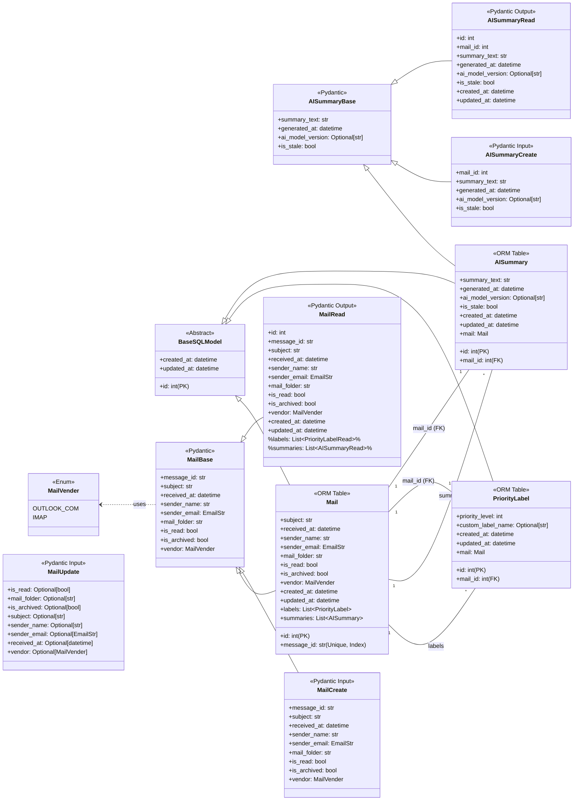

# テーブル

geminiで生成

※一部フィールド名が異なります

```mermaid
classDiagram
    direction LR

    %% Enums
    class MailVender {
        <<Enum>>
        OUTLOOK_COM
        IMAP
    }

    %% Base ORM Model
    class BaseSQLModel {
        <<Abstract>>
        +id: int (PK)
        +created_at: datetime
        +updated_at: datetime
    }

    %% Base Pydantic Models for API/Content
    class MailBase {
        <<Pydantic>>
        +message_id: str
        +subject: str
        +received_at: datetime
        +sender_name: str
        +sender_email: EmailStr
        +mail_folder: str
        +is_read: bool
        +is_archived: bool
        +vendor: MailVender
    }

    class AISummaryBase {
        <<Pydantic>>
        +summary_text: str
        +generated_at: datetime
        +ai_model_version: Optional[str]
        +is_stale: bool
    }

    %% ORM Models (Database Tables)
    class Mail {
        <<ORM Table>>
        +id: int (PK)
        +message_id: str (Unique, Index)
        +subject: str
        +received_at: datetime
        +sender_name: str
        +sender_email: EmailStr
        +mail_folder: str
        +is_read: bool
        +is_archived: bool
        +vendor: MailVender
        +created_at: datetime
        +updated_at: datetime
        +labels: List~PriorityLabel~
        +summaries: List~AISummary~
    }

    class PriorityLabel {
        <<ORM Table>>
        +id: int (PK)
        +mail_id: int (FK)
        +priority_level: int
        +custom_label_name: Optional[str]
        +created_at: datetime
        +updated_at: datetime
        +mail: Mail
    }

    class AISummary {
        <<ORM Table>>
        +id: int (PK)
        +mail_id: int (FK)
        +summary_text: str
        +generated_at: datetime
        +ai_model_version: Optional[str]
        +is_stale: bool
        +created_at: datetime
        +updated_at: datetime
        +mail: Mail
    }

    %% API Input/Output Pydantic Models
    class MailCreate {
        <<Pydantic Input>>
        +message_id: str
        +subject: str
        +received_at: datetime
        +sender_name: str
        +sender_email: EmailStr
        +mail_folder: str
        +is_read: bool
        +is_archived: bool
        +vendor: MailVender
    }

    class MailRead {
        <<Pydantic Output>>
        +id: int
        +message_id: str
        +subject: str
        +received_at: datetime
        +sender_name: str
        +sender_email: EmailStr
        +mail_folder: str
        +is_read: bool
        +is_archived: bool
        +vendor: MailVender
        +created_at: datetime
        +updated_at: datetime
        %labels: List~PriorityLabelRead~%
        %summaries: List~AISummaryRead~%
    }

    class MailUpdate {
        <<Pydantic Input>>
        +is_read: Optional[bool]
        +mail_folder: Optional[str]
        +is_archived: Optional[bool]
        +subject: Optional[str]
        +sender_name: Optional[str]
        +sender_email: Optional[EmailStr]
        +received_at: Optional[datetime]
        +vendor: Optional[MailVender]
    }

    class AISummaryCreate {
        <<Pydantic Input>>
        +mail_id: int
        +summary_text: str
        +generated_at: datetime
        +ai_model_version: Optional[str]
        +is_stale: bool
    }

    class AISummaryRead {
        <<Pydantic Output>>
        +id: int
        +mail_id: int
        +summary_text: str
        +generated_at: datetime
        +ai_model_version: Optional[str]
        +is_stale: bool
        +created_at: datetime
        +updated_at: datetime
    }


    %% Relationships
    BaseSQLModel <|-- Mail
    BaseSQLModel <|-- PriorityLabel
    BaseSQLModel <|-- AISummary

    MailBase <|-- Mail
    MailBase <|-- MailCreate
    MailBase <|-- MailRead

    AISummaryBase <|-- AISummary
    AISummaryBase <|-- AISummaryCreate
    AISummaryBase <|-- AISummaryRead

    MailVender <.. MailBase : uses

    Mail "1" -- "*" PriorityLabel : labels
    Mail "1" -- "*" AISummary : summaries

    PriorityLabel "1" -- "1" Mail : mail_id (FK)
    AISummary "1" -- "1" Mail : mail_id (FK)

    %% Note: MailUpdate does not inherit from MailBase to allow all fields Optional.
    %% Note: MailRead and AISummaryRead could potentially include nested Read models (e.g., PriorityLabelRead)
    %%       but are omitted for simplicity in this diagram unless explicitly defined.
```